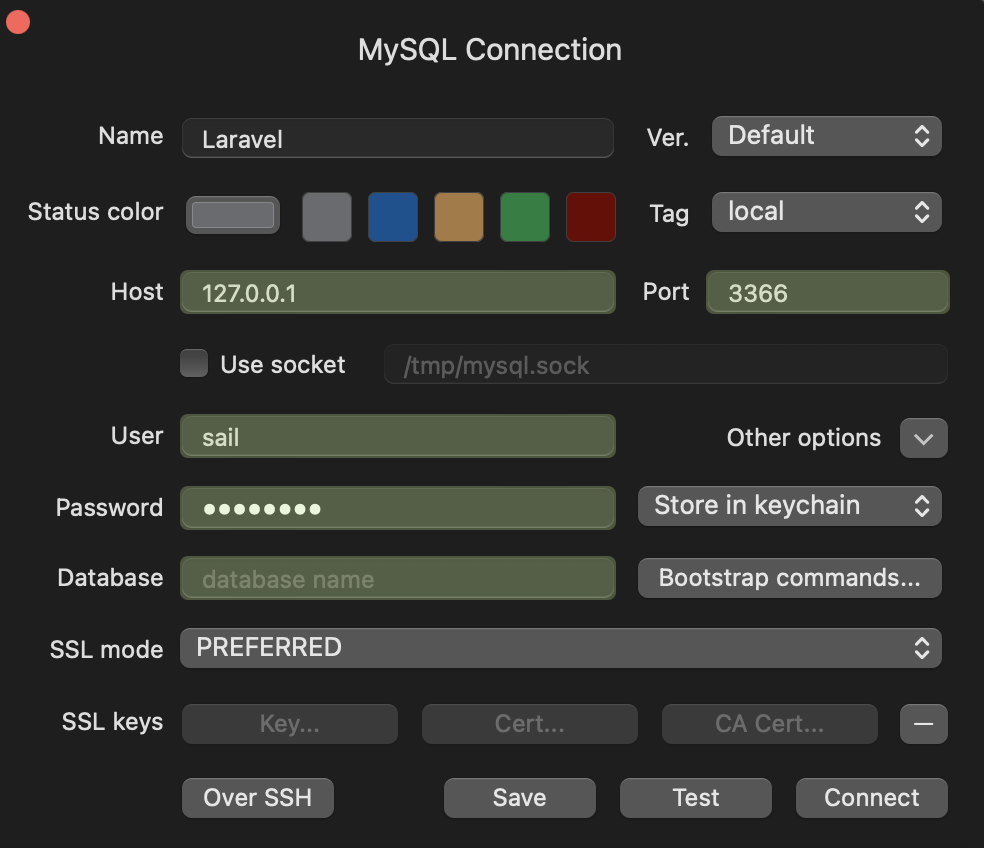

# Laravel Template

### Environment Setup
1) Run Docker Engine.
2) Clone this repository
3) Navigate to root
4) Copy the .env.example and create a new .env file (`cp .env.example .env`)
5) `composer update`
6) `docker-compose build`
7) `docker-compose up -d`
8) `docker-compose exec web npm install`
9) `docker-compose exec web npm run dev`
10) `docker-compose exec web php artisan migrate:fresh --seed`
11) A user with email **hello@halfshellstudios.co.uk** / **password** will be seeded to the database.
12) Navigate to http://127.0.0.1:8000/

**Additional**
- Any routing issues (i.e clockwork), run `docker-compose exec web php artisan route:clear`
- Rename the github folder to .github

### Laravel Pint
This template comes bundled with Laravel Pint.
https://laravel.com/docs/11.x/pint

**To run**
`docker-compose exec web ./vendor/bin/pint`

**To run against a specific folder**
i.e for **app/Models** `docker-compose exec web ./vendor/bin/pint app/Models`

### Laravel Jetstream
This template comes bundled with Laravel Jetstream by default (Livewire).
https://jetstream.laravel.com/introduction.html

**Install Jetstream With Livewire**
`docker-compose exec web php artisan jetstream:install livewire --dark`

**Or, Install Jetstream With Inertia**
`docker-compose exec web php artisan jetstream:install inertia --dark`

### MySQL Database
To access the database, you can use TablePlus or any other database management tool that supports MySQL or PostgreSQL, depending on your Laravel application's database configuration.
If you prefer using TablePlus, follow these steps:

1. **Install TablePlus**: If you haven't already installed TablePlus, download and install it from the [official website](https://tableplus.com/).

2. **Connect to the Database**:
    - Open TablePlus and click on the "+" button to create a new connection.
    - Choose the appropriate database type (MySQL or PostgreSQL) based on your Laravel application's configuration.
    - Enter the connection details such as host, port, username, password, and database name. These details can be found in your `.env` file.
    - Once the connection is established, you will be able to browse the database tables, run queries, and manage your data using TablePlus.

Below is a screenshot illustrating how to connect to a MySQL database using TablePlus:

With this addition, users following your Laravel template will have guidance on accessing the database using TablePlus or a similar tool.

### Tests
`docker-compose exec web php artisan test`

